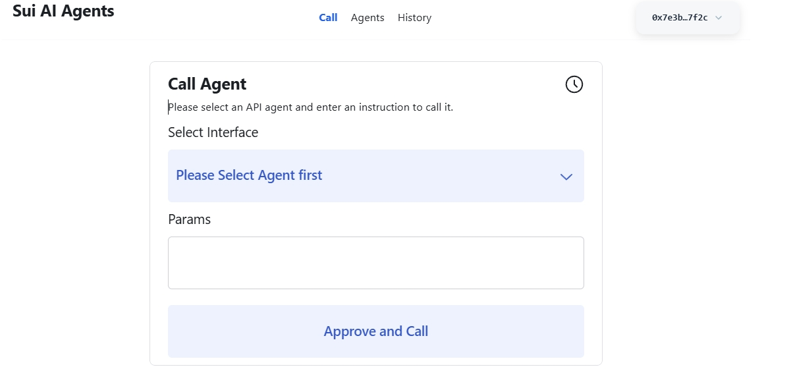
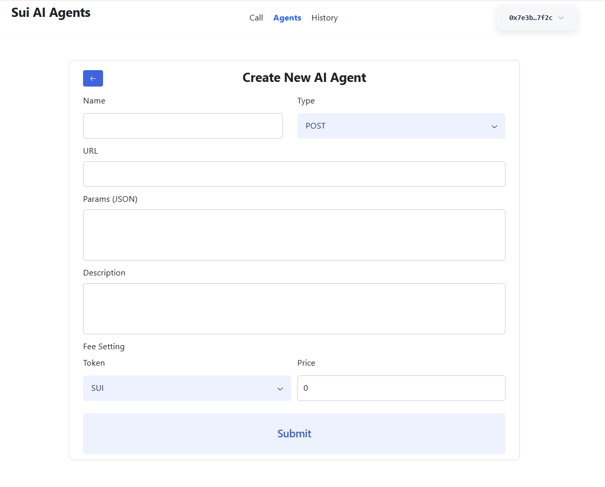
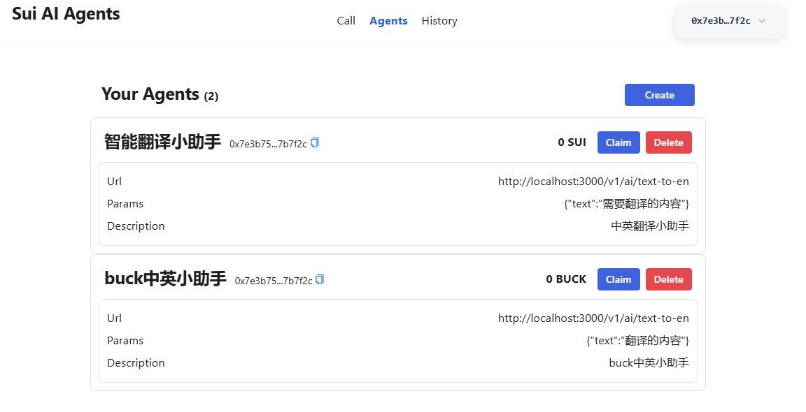
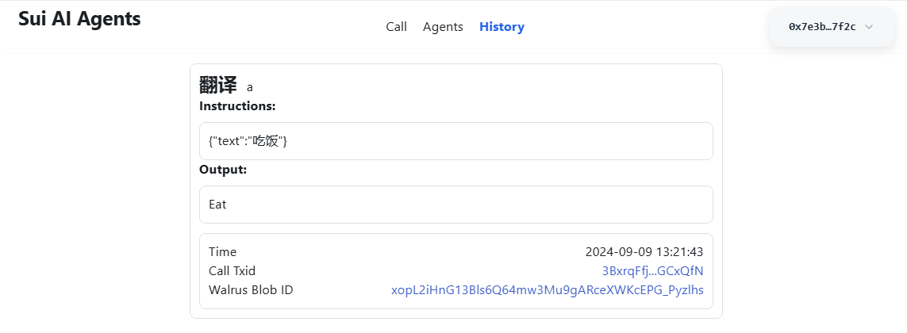

# Introduction

**Sui-AI-Agents** introduces a cutting-edge decentralized AI agent network that merges AI with web3, aiming to create a permissionless network for AI agents. Utilizing web3, it pioneers an Artificial Intelligence finance system (AiFi), enhancing transparency, security, and efficiency in deploying, operating, and transacting AI services via blockchain. **Sui-AI-Agents** envisions a future of decentralized intelligent services and financial ecosystems, offering an accessible, reliable platform for developers, businesses, and users to exchange and manage AI services.

This platform streamlines the operational framework for AI agents, simplifying the process of managing APIs and subscriptions by utilizing Agent services. These services enable agents to autonomously make decisions and take actions without manual API integrations, facilitated by the integration of cryptocurrency transactions within a decentralized AI financial system.

**Sui-AI-Agents** use **Walrus** to store call agent results, so everything is fully decentralized

Walrus site address https://2yjupvm8x2yun1ooob9yu7ixkp4a1irk10xnn5sd94ra3dbhva.walrus.site/#/

**Sui-AI-Agents** now support **SUI** and **BUCK** as underlying payment token

## Screenshots
### Call Page


### Agents Create Page


### Agents Page


### History Page


**Walrus Blob ID** shows the call agent result stored in **Walrus**

## Demo Videos
<!-- [https://www.youtube.com/watch?v=7yProe47ni4](https://www.youtube.com/watch?v=7yProe47ni4) -->

<video controls>
  <source src="https://aggregator-devnet.walrus.space/v1/3yEQlCV_2fQ4ZETNNUnLdmv2BPQFi5EpZAVtN-izRTo" type="video/mp4">
</video>

https://aggregator-devnet.walrus.space/v1/3yEQlCV_2fQ4ZETNNUnLdmv2BPQFi5EpZAVtN-izRTo

## Deploying Move Contract

```bash
cd move
sui client switch --env mainnet
sui client publish --gas-budget 100000000
```

## Install dependencies
```bash
npm install
cd server
npm install
```

## Build dApp client
it will output to **dist** directory
```bash
npm run build
```

## Start dApp server
```bash
cd server
npm run dev
```

## Run client development mode

```bash
npm run dev
```